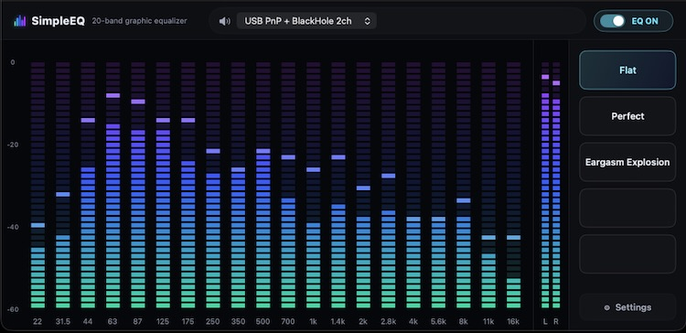
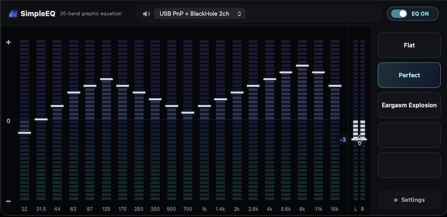
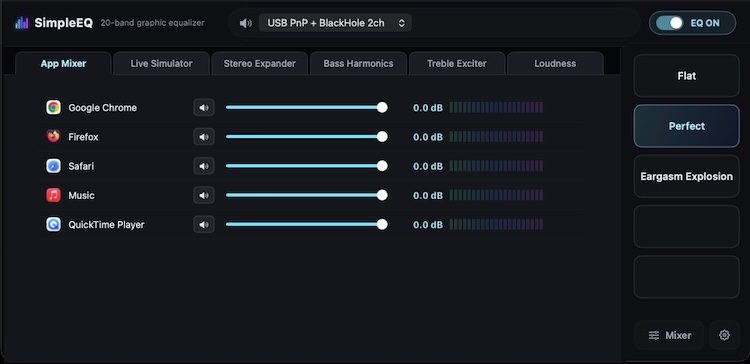

# SimpleEQ

macOS でシステム全体の出力音声を加工するグラフィックイコライザー。
かつてのカーオーディオ（絶滅危惧種w）に搭載されていたものをイメージ。

出力デバイスとの間に割り込んで、システムから出るすべての音（ブラウザ、音楽プレーヤー、通知音など）を加工できる。また、加工と同時にビジュアライザーが動く。







---

## 特徴

- L/R 2ch 20バンドのグラフィックイコライザー（22〜16kHz）でシステム全体の出力音声を加工
- 加工した音をそのままリアルタイムでビジュアライズ。各バンドのピークインジケーターを一定時間ホールド表示
- **プリセット5枠**：ワンクリックで適用、プリセットボタンの長押しで現在のゲインカーブを上書き保存。タイトルも編集可能
- **プリアンプ**：EQ で音を持ち上げた際の音割れ防止用に全帯域を一括で調整。ゲインカーブの特性に合わせて自動調整することも可能
- **アプリ別ミキサー**：アプリごとに音量を下げる/ミュートできる。設定はアプリ単位で保存される
- 出力先デバイスをリアルタイムに選択可能
- メニューバー常駐。アイコンから EQ ウィンドウの表示/非表示・ビューモード・プリセット・出力デバイスを切替
- 常に最前面表示・起動時の自動表示・ログイン時の自動起動など、細かい挙動を Settings 画面から調整可能

---

## 動作環境

- macOS 15 以降
- ビルドおよびインストールには [Xcode](https://apps.apple.com/jp/app/xcode/id497799835?mt=12)（Command Line Tools のみでは不可）と [XcodeGen](https://github.com/yonaskolb/XcodeGen)（`brew install xcodegen`）が必要

---

## セットアップ

### 1. アプリ本体のインストール

- このリポジトリを `git clone` するか、[ZIP でダウンロード](https://github.com/hirokidoi/SimpleEQ/archive/refs/heads/master.zip) して展開する。

- プロジェクトのルートディレクトリで以下のコマンドを実行するとビルドされ、`/Applications/SimpleEQ.app` にアプリがインストールされる。
  ```
  make install
  ```

### 2. 専用ドライバの導入（初回のみ）

- システム音声を取り込むための専用ドライバのインストールが必要。
- 未導入の状態でアプリを起動するとインストール確認のダイアログが出現するので、ガイドに従ってアプリ内からインストールする（管理者権限が必要）。
- Settings 画面で、導入状況の確認・インストール/更新・アンインストールが実行可能。

### 3. 出力デバイスの確認

- 起動するタイミングで選択されていた出力デバイス（スピーカーやモニターなど）が自動的に選択される。
- Settings 画面で、任意の出力デバイスに固定することや OS 側での出力デバイス切り替えを自動追従させることも可能。

---

## 使い方

- メニューバーのアイコンをクリックするとメニューが開く。
- ビジュアライザーを長押しすると EQ バーと L/R メーターの設定用ハンドル（白い横線）が現れる。
- **EQ 本体**：20本のバーそれぞれが1つの周波数帯に対応
  - バーの発光の高さ：その帯域の再生レベル（ビジュアライザー）
  - バー上のハンドル：その帯域のゲイン設定。ハンドルを掴んでドラッグすると、そのバンドだけを上下に動かして 1dB 刻みでゲインを変更でき、ハンドルをダブルクリックするとフラット（0dB）に戻る。バー本体を直接クリック・ドラッグした場合は、掴んだ高さがそのまま設定値になり、線を描くように左右へ動かせば複数バンドをまとめて設定できる。
- **マスターレベルメーター**：音声の L/R チャンネルそれぞれのマスターレベルを表示する。Settings から表示/非表示を切り替え可能。
  - ピークインジケーター：最上段が赤く点灯している間は EQ で持ち上げた音がフルスケールを超えている（＝音が割れている）状態のため、各バンドのゲインやプリアンプを下げて点灯しないようにレベルを調整する。
  - バー上のハンドル：プリアンプの設定値。ハンドルを掴んでドラッグすると 1dB 刻みで変更でき、ハンドルをダブルクリックするとプリアンプが AUTO モード（自動調整）になる。
- **プリアンプ**：AUTO モードはゲインカーブから下げ幅を自動で決める。ハンドルやスライダーを手で動かすと AUTO が外れ手動設定モードに切り替わる。
- **プリセット**：ワンクリックでそのゲインカーブへ切り替わる。ボタンを長押しすると、その時点でセットされているゲインカーブをそのプリセットボタンへタイトル付きで保存できる。プリアンプの値は保存されない。
- **上部バー**：
  - 異常時のみ警告チップが表示される。
  - 出力先チップ：実際に音を出すデバイスをその場で選び直すことができる。チップ内のスピーカーアイコンをクリックするとプリアンプの調整パネルが開く。
  - EQ ON/OFF スイッチ：EQ とプリアンプの加工をまとめてバイパスに切り替えることができる。
- **ウィンドウ操作**：上部バーをドラッグすると移動、ダブルクリックでビューを切り替え、右クリックで非表示・最前面表示・ビュー切り替え・Mixer のメニューが開く。⌘W で閉じる。
- **コンパクトビュー**：ビジュアライザーや Mixer をコンパクトに表示する。ダブルクリックでノーマルビューに戻る。
- **Mixer**：メニューバーの「EQ Mixer を表示」、または EQ ウィンドウ左下の Mixer ボタンから開く。
  - アプリごとに音量を下げる/ミュートできる。
  - 右クリックメニューの「Edit」または Mixer ボタンを長押しで編集モードに入る。
  - 編集モードでは、Mixer に表示させるアプリの選択、ドラッグで並べ替えができる。右クリックメニューの「Done」または Mixer ボタンを押して確定。
- **Settings**：設定画面が開き、常に最前面表示・自動起動・ビューモード・出力デバイスの既定値・ビジュアライザーの見え方などを調整できる。

---

## Notes

### アプリインストールに関する補足

- 既に Command Line Tools が入っている環境では、Xcode を導入しても `xcodebuild` が Command Line Tools を指したままになりビルドが失敗する。その場合は以下のコマンドで向き先を切り替え、Xcode の初回セットアップ（追加コンポーネントの導入とライセンス同意）を済ませてから `make install` を実行し直す（管理者権限が必要）。
  ```
  sudo xcode-select -s /Applications/Xcode.app
  sudo xcodebuild -runFirstLaunch
  ```
- インストール後、`git clone` あるいは ZIP を展開したディレクトリ（プロジェクト）は削除してよい。

### コード署名（Codesign）

- 自力ビルド前提のため、App Store 配信や開発者署名は行っておらず、ビルドしたアプリはローカル専用の署名（ad-hoc）のまま。

### 出力デバイスの制限

- AirPlay デバイスへの出力には対応していない。

---

## License

- MIT License. See [LICENSE](LICENSE) for details.
- 専用ドライバ: [Driver/SimpleEQAudio/LICENSE](Driver/SimpleEQAudio/LICENSE)
